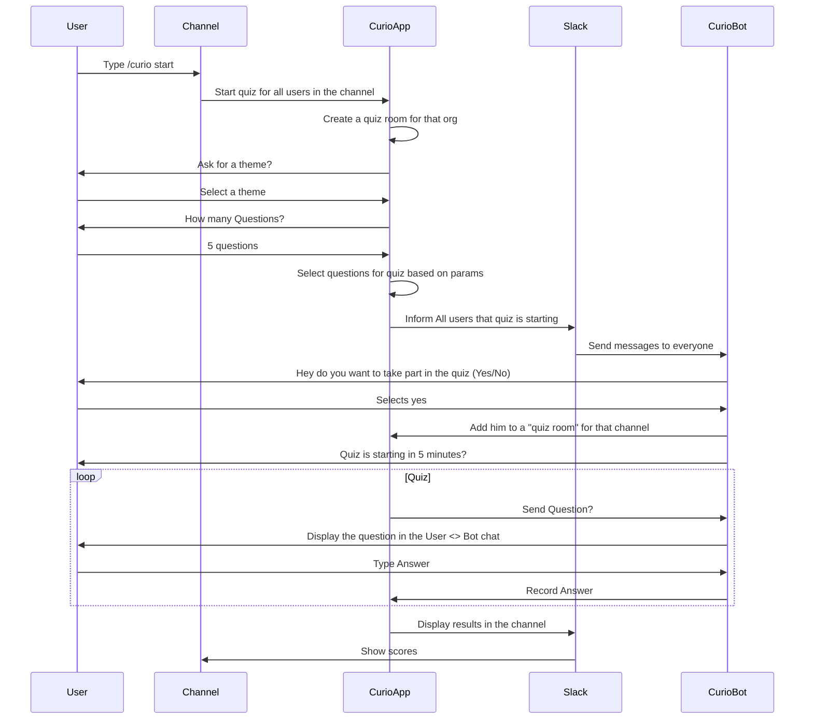

```mermaid
sequenceDiagram
    User ->> Channel: Type /curio start
    Channel ->> CurioApp: Start quiz for all users in the channel
    CurioApp ->> CurioApp: Create a quiz room for that org
    CurioApp ->> User: Ask for a theme?
    User ->> CurioApp: Select a theme
    CurioApp ->> User: How many Questions?
    User ->> CurioApp: 5 questions
    CurioApp ->> CurioApp: Select questions for quiz based on params
    CurioApp ->> Slack: Inform All users that quiz is starting
    Slack ->> CurioBot: Send messages to everyone
    CurioBot ->> User: Hey do you want to take part in the quiz (Yes/No)
    User ->> CurioBot: Selects yes
    CurioBot ->> CurioApp: Add him to a "quiz room" for that channel
    CurioBot ->> User: Quiz is starting in 5 minutes?
    loop Quiz
      CurioApp ->> CurioBot: Send Question?
      CurioBot ->> User: Display the question in the User <> Bot chat
      User ->> CurioBot: Type Answer
      CurioBot ->> CurioApp: Record Answer
    end
    CurioApp ->> Slack: Display results in the channel
    Slack ->> Channel: Show scores
```
